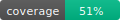

# NutriMais AI

<!-- coverage-badge:start -->

<!-- coverage-badge:end -->


> Planeje sua alimentação com inteligência artificial

**NutriMais AI** é uma aplicação web inteligente que simplifica o planejamento nutricional. Defina suas metas de calorias, escolha os alimentos que você gosta, e deixe a IA calcular automaticamente as porções ideais para uma dieta balanceada (40% carboidratos, 30% proteína, 30% gordura).

---

## 🌟 Características

### 🧠 Inteligência Artificial
- Cálculo automático de porções usando **Google Gemini 2.0**
- Distribuição de macronutrientes cientificamente balanceada (40/30/30)
- Análise de índice glicêmico e carga glicêmica
- Sugestões personalizadas baseadas nos seus alimentos

### 📊 Acompanhamento Completo
- Histórico de refeições com estatísticas
- Registro de atividades físicas (116+ atividades catalogadas)
- Evolução do peso com gráficos interativos
- Dashboard com progresso das metas

### 💬 Assistente Nutricional
- Chat com IA disponível 24/7
- Dicas personalizadas baseadas no seu perfil
- Respostas sobre nutrição e saúde
- Ajuste de planejamento em tempo real

### 🎯 Perfil Personalizado
- Metas de calorias por refeição
- Dados de saúde (peso, altura, IMC)
- Configuração de número de refeições diárias
- Sistema de favoritos para alimentos

---

## 🚀 Quick Start

### Pré-requisitos
- Node.js 18+
- Conta no Supabase
- Chave de API do Google Gemini

### Instalação

```bash
# 1. Clonar repositório
git clone https://github.com/netsacolas/NutriMais.git
cd NutriMais

# 2. Instalar dependências
npm install

# 3. Configurar variáveis de ambiente
# Criar arquivo .env.local na raiz:
VITE_GEMINI_API_KEY=sua_chave_gemini_aqui
VITE_SUPABASE_URL=sua_url_supabase_aqui
VITE_SUPABASE_ANON_KEY=sua_chave_supabase_aqui

# 4. Configurar banco de dados
# Executar migrações SQL no Supabase:
# - supabase/migrations/*.sql

# 5. Rodar em desenvolvimento
npm run dev
```

### Acessar
- **Landing Page**: http://localhost:3000/index.html (página inicial)
- **Aplicação**: http://localhost:3000/login.html (área autenticada)

---

## 📁 Estrutura do Projeto

```
NutriMais/
├── 📄 index.html                # Landing page pública (página inicial)
├── 📄 login.html                # Aplicação principal (autenticada)
├── 📄 App.tsx                   # Componente raiz
├── 📄 types.ts                  # Tipos TypeScript
│
├── 📂 components/
│   ├── MealPlanner.tsx          # Planejador de refeições
│   ├── MealResult.tsx           # Resultados e edição
│   ├── Auth/
│   │   ├── AuthFlow.tsx         # Fluxo de autenticação
│   │   ├── Login.tsx            # Tela de login
│   │   └── SignUp.tsx           # Tela de cadastro
│   └── UserPanel/
│       ├── ProfileModal.tsx     # Perfil do usuário
│       ├── HealthModal.tsx      # Saúde e metas
│       ├── HistoryModal.tsx     # Históricos
│       ├── MealHistory.tsx      # Histórico de refeições
│       ├── WeightHistory.tsx    # Evolução do peso
│       ├── PhysicalActivityHistory.tsx
│       └── NutritionChat.tsx    # Chat com IA
│
├── 📂 services/
│   ├── geminiService.ts         # Integração Gemini API
│   ├── supabaseClient.ts        # Cliente Supabase
│   ├── authService.ts           # Autenticação
│   ├── profileService.ts        # Perfil de usuário
│   ├── mealHistoryService.ts    # CRUD refeições
│   ├── weightHistoryService.ts  # CRUD peso
│   └── physicalActivityService.ts
│
├── 📂 data/
│   └── activitiesDatabase.ts    # Banco de 116 atividades
│
├── 📂 utils/
│   └── bmiUtils.ts              # Cálculos de IMC
│
├── 📂 supabase/
│   ├── migrations/              # Migrações SQL
│   └── functions/               # Edge Functions
│
└── 📂 docs/
    ├── CLAUDE.md                # Documentação técnica completa
    ├── LANDING_PAGE.md          # Guia da landing page
    ├── CHANGELOG_REBRAND.md     # Histórico de mudanças
    ├── SECURITY.md              # Auditoria de segurança
    └── SUPABASE_SETUP.md        # Setup do Supabase
```

---

## 🛠️ Stack Tecnológica

### Frontend
- **React 19.2.0** - UI library
- **TypeScript 5.8.2** - Type safety
- **Vite 6.2.0** - Build tool
- **TailwindCSS 3.x** - Styling

### Backend & Services
- **Supabase** - BaaS (PostgreSQL + Auth)
- **Google Gemini 2.0** - AI model
- **Recharts 3.3.0** - Data visualization

### Infraestrutura
- **Supabase Edge Functions** - Serverless backend
- **Row Level Security (RLS)** - Database security
- **AI Studio CDN** - Dependency hosting

---

## 📖 Documentação

### Guias Principais
- [📘 Documentação Técnica Completa](CLAUDE.md)
- [🎨 Guia da Landing Page](LANDING_PAGE.md)
- [🔒 Relatório de Segurança](SECURITY.md)
- [⚙️ Configuração do Supabase](SUPABASE_SETUP.md)

### Changelog
- [📝 Histórico de Mudanças - Rebranding](CHANGELOG_REBRAND.md)
- [✅ Migração para Edge Functions](MIGRATION_COMPLETE.md)
- [🔐 Melhorias de Segurança](SECURITY_IMPROVEMENTS.md)

---

## 🎨 Landing Page

A landing page ([index.html](index.html)) é a página inicial que apresenta o NutriMais AI aos visitantes:

### Destaques
- ✅ Design moderno com gradientes verde-água → violeta → rosa
- ✅ 9 seções completas (Hero, Como Funciona, Recursos, Benefícios, Preços, CTA, Rodapé)
- ✅ Tabela de preços com 3 planos (Mensal, Trimestral, Anual)
- ✅ 100% responsivo (mobile-first)
- ✅ Animações suaves e efeitos hover
- ✅ CTAs estrategicamente posicionados

### Navegação
- **Visitantes**: `index.html` (landing page) → Botões redirecionam para `login.html`
- **Usuários autenticados**: `login.html` → Aplicação completa

---

## 🔐 Segurança

### Status
- **Score**: 85/100 ✅
- **Auditoria**: Completa (ver [SECURITY.md](SECURITY.md))

### Implementações
- ✅ Autenticação com Supabase (JWT)
- ✅ Row Level Security (RLS) no banco
- ✅ Edge Functions para APIs sensíveis
- ✅ Rate limiting (20 req/hora)
- ✅ Validação de inputs
- ✅ HTTPS obrigatório
- ⚠️ LGPD em conformidade parcial (ver roadmap)

---

## 📊 Features Principais

### 1. Planejamento de Refeições
```typescript
// Usuário informa:
- Tipo de refeição (café, almoço, jantar, lanche)
- Meta de calorias (ex: 600 kcal)
- Alimentos desejados (ex: arroz, frango, brócolis)

// IA retorna:
- Porções exatas em gramas e medidas caseiras
- Distribuição 40% carbs, 30% proteína, 30% gordura
- Índice glicêmico médio ponderado
- Carga glicêmica total
- Fibras totais
- Sugestões personalizadas
```

### 2. Edição Interativa
- Ajuste de porções em tempo real
- Recálculo automático de macros
- Atualização de calorias e índices

### 3. Históricos
- **Refeições**: Filtros (semana/mês/tudo) + estatísticas
- **Peso**: Gráfico de evolução + variações
- **Atividades**: 116+ atividades com cálculo de calorias queimadas (MET values)

### 4. Assistente de IA
- Chat contextual com histórico do usuário
- Dicas baseadas em dados reais
- Ajustes de planejamento personalizados

---

## 🧪 Scripts Disponíveis

```bash
# Desenvolvimento
npm run dev          # Servidor local (porta 3000)

# Build
npm run build        # Build de produção

# Preview
npm run preview      # Preview do build

# Deploy (Supabase Edge Functions)
npx supabase functions deploy gemini-proxy
npx supabase functions deploy nutrition-chat
```

---

## 🌐 Deploy

### Produção

#### 1. Frontend (Vercel/Netlify)
```bash
# Build
npm run build

# Deploy (Vercel)
vercel --prod

# Configurar variáveis de ambiente no dashboard
```

#### 2. Backend (Supabase)
```bash
# Deploy Edge Functions
npx supabase functions deploy gemini-proxy
npx supabase functions deploy nutrition-chat

# Configurar secrets
npx supabase secrets set GEMINI_API_KEY=sua_chave
```

#### 3. Banco de Dados
- Executar migrações SQL via Dashboard
- Ativar RLS em todas as tabelas
- Verificar políticas de acesso

---

## 🎯 Roadmap

### ✅ Implementado
- [x] Sistema de autenticação completo
- [x] Planejamento de refeições com IA
- [x] Histórico de refeições, peso e atividades
- [x] Assistente nutricional com chat
- [x] Landing page moderna
- [x] Sistema de segurança robusto
- [x] Edge Functions para APIs

### 🚧 Em Desenvolvimento
- [ ] App mobile (React Native)
- [ ] Modo offline (PWA)
- [ ] Exportação de dados (PDF/Excel)
- [ ] Planejamento semanal

### 📋 Planejado
- [ ] Integração com wearables (Fitbit, Apple Health)
- [ ] Reconhecimento de alimentos por foto
- [ ] Receitas e planos prontos
- [ ] Comunidade e compartilhamento
- [ ] Gamificação (badges, streaks)
- [ ] Suporte multilíngue

---

## 🤝 Contribuindo

Contribuições são bem-vindas! Por favor:

1. Fork o projeto
2. Crie uma branch (`git checkout -b feature/NovaFeature`)
3. Commit suas mudanças (`git commit -m 'Add: Nova feature'`)
4. Push para a branch (`git push origin feature/NovaFeature`)
5. Abra um Pull Request

### Guidelines
- Seguir padrão de código TypeScript
- Adicionar testes para novas features
- Atualizar documentação
- Manter commits semânticos

---

## 📄 Licença

Este projeto é proprietário. Todos os direitos reservados.

---

## 👥 Time

**Desenvolvedor Principal**: Nicolas
**IA Assistant**: Claude (Anthropic)
**Design**: Conceito próprio

---

## 📞 Contato

- **Email**: suporte@nutrimais.com
- **GitHub**: [@netsacolas](https://github.com/netsacolas)
- **Website**: [nutrimais.com.br](https://nutrimais.com.br) (em breve)

---

## 🙏 Agradecimentos

- Google Gemini AI pela tecnologia de IA
- Supabase pela infraestrutura de backend
- Comunidade React e TypeScript
- Todos os early adopters e testers

---

<div align="center">

**NutriMais AI** - Planejamento alimentar inteligente ao seu alcance

🥗 🧠 💪

[Começar Agora](index.html) • [Documentação](CLAUDE.md) • [Suporte](mailto:suporte@nutrimais.com)

</div>

---

**Última atualização**: Janeiro 2025
**Versão**: 2.0.0

---

## 🔗 Links Úteis

- **AI Studio App**: https://ai.studio/apps/drive/1Dbi9jO-Jmlmz2eT3Ldk05Q6NHUO1xVD8
- **Repository**: https://github.com/netsacolas/NutriMais.git
